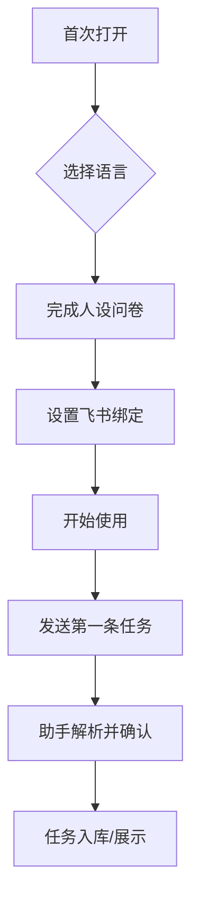
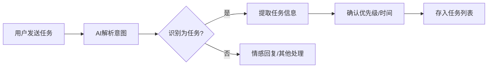
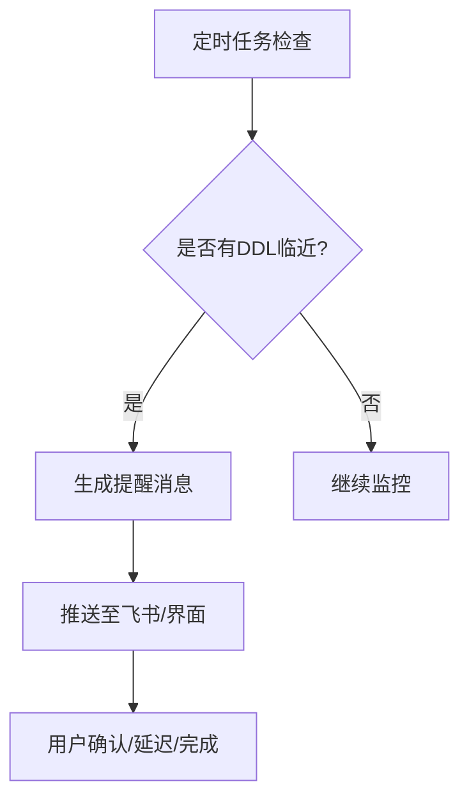

# 产品运营助手 - 产品需求文档

## 1. 产品概述

一款集任务管理、智能提醒与情绪陪伴于一体的AI产品运营助手。通过自然的对话方式，帮助用户整理任务、追踪DDL，并在关键时刻提供温暖的情绪支持。定位为用户的"靠谱搭档+知心导师"。

**核心价值**：让用户不再遗漏任何重要任务，同时在高压工作中获得持续的情绪能量。

**目标用户**：产品经理、运营人员、创业者等需要高效管理多项任务且追求个人成长的职场人士。

## 2. 核心功能模块

### 2.1 用户角色

| 角色 | 权限范围 | 核心场景 |
|------|---------|---------|
| 普通用户 | 任务管理、提醒设置、人设定制 | 日常任务整理、DDL提醒、情绪对话 |

### 2.2 功能模块

1. **智能任务中心**
   - 任务创建（支持自然语言输入）
   - 优先级标记（P0-P3）
   - DDL设置与倒计时显示
   - 任务状态管理（待办/进行中/已完成）
   - 自动排序（按优先级+时间）

2. **AI对话助手**
   - 自然语言任务解析
   - 上下文感知的任务建议
   - 情绪识别与正向引导
   - 个性化人设互动

3. **人设定制系统**
   - 初始引导问卷（5-8个问题快速建立人设）
   - 语气风格选择（严格/温柔/幽默/激励）
   - 专属称呼与称呼方式
   - 对话记忆与人设一致性

4. **飞书集成**
   - 飞书机器人消息接收与发送
   - 任务同步推送
   - DDL到期提醒
   - Webhook实时交互

5. **时间线视图**
   - 日视图/周视图切换
   - 任务时间线可视化
   - 即将到期的任务高亮提醒
   - 工作负载分布图

## 3. 核心交互流程

### 3.1 首次使用流程



### 3.2 任务创建流程



### 3.3 提醒触发流程



## 4. 用户界面设计

### 4.1 设计风格

**整体调性**：温暖治愈 + 专业高效

**色彩方案**：
- 主色：柔和渐变橙 `#FF9A56` → `#FF6B6B`
- 辅助色：温暖米白 `#FFF8F0`
- 强调色：活力青 `#4ECDC4`
- 文字色：深棕 `#2D2A26`
- 状态色：
  - 紧急：珊瑚红 `#FF6B6B`
  - 重要：琥珀金 `#FFB347`
  - 普通：薄荷绿 `#A8E6CF`
  - 低优：天空蓝 `#88D8B0`

**字体选择**：
- 标题：`Noto Sans SC` (Bold) - 现代有力
- 正文：`Noto Sans SC` (Regular) - 清晰易读
- 数字/时间：`DIN Alternate` - 专业精准

**按钮风格**：圆角胶囊形，hover时微弹跳，active时轻微下沉

**布局风格**：卡片式布局，左侧任务列表+主区域详情/对话，右侧时间线

**动效风格**：
- 页面切换：滑动渐变
- 任务完成：庆祝动画（撒花/烟花）
- 提醒：脉冲呼吸动画
- 加载：温州市CSS动画

### 4.2 页面设计

#### 4.2.1 主界面（桌面端）

| 区域 | 模块 | UI元素 |
|------|------|--------|
| 顶部导航栏 | Logo + 用户信息 + 设置入口 | 圆形头像、微渐变背景 |
| 左侧边栏 | 任务列表 | 筛选标签（全部/今日/本周/P0）、搜索框、任务卡片列表 |
| 中央主区 | 对话/任务详情 | AI头像、对话气泡、任务编辑表单 |
| 右侧边栏 | 时间线 | 日历视图、DDL倒计时卡片、每日任务预览 |
| 底部 | 快捷输入 | 输入框、表情选择、快捷命令 |

#### 4.2.2 人设定制页面

| 模块 | UI元素 | 交互细节 |
|------|--------|---------|
| 欢迎模块 | 温暖问候语、渐变背景 | 3秒自动进入 |
| 问卷卡片 | 问题卡片、选项按钮 | 左右滑动切换 |
| 人设预览 | AI头像+文字气泡 | 实时预览效果 |
| 确认按钮 | 渐变大按钮 | 完成后跳转主页 |

#### 4.2.3 飞书机器人界面

| 模块 | UI元素 |
|------|--------|
| 消息气泡 | 用户消息 + 助手回复 |
| 任务卡片 | 优先级标签、DDL、时间 |
| 快捷操作 | 完成/延迟/详情按钮 |
| 人设风格 | 一致的对话语气 |

### 4.3 响应式设计

- **桌面端（>1200px）**：三栏布局，完整功能
- **平板端（768-1200px）**：两栏布局，时间线收起
- **移动端（<768px）**：单栏布局，底部Tab切换

### 4.4 情感化设计

- **空状态**：温暖的插画 + 鼓励文字（如"还没有任务呀，今天想完成什么？"）
- **完成庆祝**：任务完成时AI发送鼓励语 + 微动画
- **DDL临近**：紧张但不恐怖的提醒（如"还有一个小时就要到期啦，需要帮你延后吗？"）
- **高负荷提示**：温柔提醒（如"今天有3个P0任务，要不要调整一下优先级？"）

## 5. 数据结构

### 5.1 任务模型

```typescript
interface Task {
  id: string;
  title: string;
  description?: string;
  priority: 'P0' | 'P1' | 'P2' | 'P3';
  deadline?: Date;
  status: 'todo' | 'in_progress' | 'done';
  createdAt: Date;
  updatedAt: Date;
  tags?: string[];
}
```

### 5.2 人设模型

```typescript
interface Persona {
  name: string;
  tone: 'strict' | 'gentle' | 'humorous' | 'motivational';
  greeting: string;
  specialties: string[];
  memory: string[];
}
```

### 5.3 对话记录

```typescript
interface Message {
  id: string;
  role: 'user' | 'assistant';
  content: string;
  timestamp: Date;
  relatedTaskId?: string;
}
```

## 6. 技术架构

**前端**：React 18 + TailwindCSS + Vite
**后端**：Node.js + Express + SQLite
**消息推送**：飞书开放平台 API
**实时通讯**：WebSocket

## 7. MVP版本优先级

### P0 - 必须有
1. 基础任务管理（CRUD）
2. 优先级与DDL设置
3. AI对话界面（任务解析）
4. 桌面端界面

### P1 - 应该有
5. 飞书机器人集成
6. 人设定制系统
7. 基础提醒功能

### P2 - 可以有
8. 移动端适配
9. 时间线视图
10. 高级情绪识别
