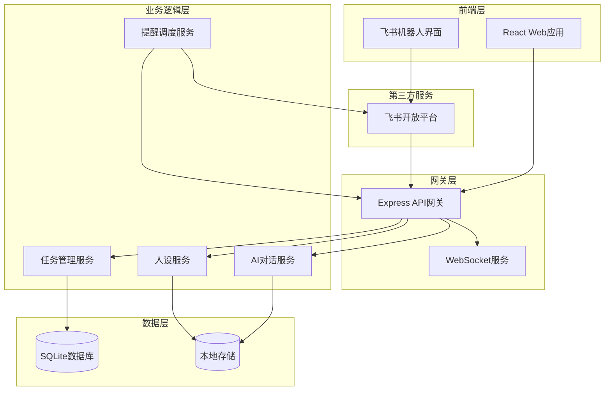
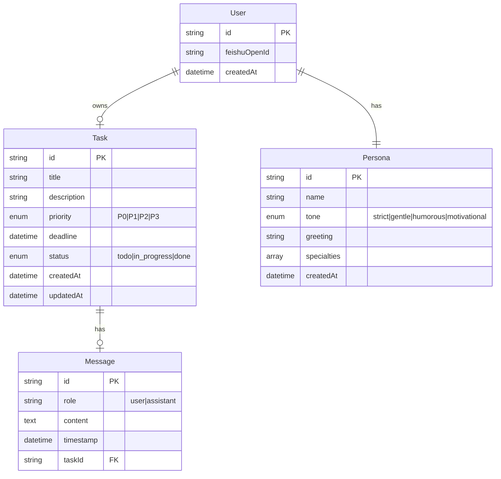

# 产品运营助手 - 技术架构文档

## 1. 系统架构设计

### 1.1 整体架构



### 1.2 技术栈选型

| 层级 | 技术选型 | 说明 |
|------|---------|------|
| 前端框架 | React 18 | 组件化开发，生态完善 |
| 构建工具 | Vite | 快速开发体验 |
| 样式方案 | TailwindCSS | 原子化CSS，高效开发 |
| 后端框架 | Express 4 | 轻量级，灵活扩展 |
| 数据库 | SQLite | 零配置，适合MVP阶段 |
| 实时通信 | Socket.io | WebSocket封装，支持自动重连 |
| 消息推送 | 飞书开放平台API | 机器人消息、卡片消息 |

### 1.3 项目结构

```
/workspace
├── client/                 # React前端应用
│   ├── src/
│   │   ├── components/     # UI组件
│   │   │   ├── Chat/      # 对话相关组件
│   │   │   ├── Task/      # 任务管理组件
│   │   │   ├── Persona/   # 人设定制组件
│   │   │   └── Layout/    # 布局组件
│   │   ├── hooks/         # 自定义Hooks
│   │   ├── services/      # API服务
│   │   ├── stores/        # 状态管理
│   │   ├── styles/        # 全局样式
│   │   └── utils/         # 工具函数
│   └── index.html
│
├── server/                 # Express后端服务
│   ├── routes/            # 路由定义
│   ├── controllers/      # 控制器
│   ├── services/         # 业务逻辑
│   ├── models/           # 数据模型
│   ├── middleware/       # 中间件
│   ├── socket/           # WebSocket处理
│   └── index.js
│
└── feishu/               # 飞书机器人配置
    └── app.js
```

## 2. 技术实现细节

### 2.1 前端架构

**状态管理**：使用React Context + useReducer管理全局状态
- TaskContext：任务列表状态
- PersonaContext：人设配置状态
- ChatContext：对话历史状态

**组件层级**：
```
App
├── Layout
│   ├── Header
│   ├── Sidebar
│   │   ├── TaskList
│   │   └── QuickActions
│   └── MainContent
│       ├── ChatPanel
│       └── TaskDetail
└── PersonaSetup (条件渲染)
```

**样式策略**：
- 使用CSS变量管理主题色
- 组件级别TailwindCSS类
- 全局动画使用CSS @keyframes

### 2.2 后端架构

**路由结构**：

| 路由 | 方法 | 功能 |
|------|------|------|
| /api/tasks | GET | 获取任务列表 |
| /api/tasks | POST | 创建新任务 |
| /api/tasks/:id | PUT | 更新任务 |
| /api/tasks/:id | DELETE | 删除任务 |
| /api/persona | GET | 获取人设配置 |
| /api/persona | POST | 保存人设配置 |
| /api/chat | POST | 发送消息 |
| /api/feishu/webhook | POST | 接收飞书消息 |

**控制器职责**：
- TaskController：任务CRUD操作
- PersonaController：人设配置管理
- ChatController：对话处理与AI响应
- FeishuController：飞书消息处理

**服务层设计**：
```
controllers/
├── taskController.js    # 接收请求
└── taskService.js       # 处理业务逻辑
    └── taskRepository.js # 数据访问
```

### 2.3 AI对话服务

**任务解析流程**：
1. 接收用户自然语言输入
2. 使用关键词匹配提取：任务名、优先级、DDL
3. 正则表达式识别时间表达式（今天、明天、周五等）
4. 生成结构化任务对象
5. 返回确认消息给用户

**回复生成策略**：
- 任务相关：根据人设tone生成回复
- 闲聊：根据人设性格生成温暖回复
- 情绪识别：检测负面情绪，触发鼓励模式

### 2.4 飞书集成

**机器人能力**：
- 接收用户@消息
- 解析任务指令
- 发送卡片消息（任务详情）
- 推送DDL提醒

**消息格式**：
```json
{
  "msg_type": "interactive",
  "card": {
    "header": {
      "title": {"tag": "plain_text", "content": "任务提醒"},
      "template": "red"
    },
    "elements": [...]
  }
}
```

## 3. 数据模型设计

### 3.1 数据实体关系



### 3.2 数据库表结构

#### 3.2.1 tasks 表

```sql
CREATE TABLE tasks (
    id TEXT PRIMARY KEY,
    title TEXT NOT NULL,
    description TEXT,
    priority TEXT DEFAULT 'P2' CHECK(priority IN ('P0', 'P1', 'P2', 'P3')),
    deadline DATETIME,
    status TEXT DEFAULT 'todo' CHECK(status IN ('todo', 'in_progress', 'done')),
    created_at DATETIME DEFAULT CURRENT_TIMESTAMP,
    updated_at DATETIME DEFAULT CURRENT_TIMESTAMP
);

CREATE INDEX idx_tasks_status ON tasks(status);
CREATE INDEX idx_tasks_deadline ON tasks(deadline);
CREATE INDEX idx_tasks_priority ON tasks(priority);
```

#### 3.2.2 personas 表

```sql
CREATE TABLE personas (
    id TEXT PRIMARY KEY,
    name TEXT NOT NULL,
    tone TEXT DEFAULT 'gentle' CHECK(tone IN ('strict', 'gentle', 'humorous', 'motivational')),
    greeting TEXT,
    specialties TEXT,
    created_at DATETIME DEFAULT CURRENT_TIMESTAMP
);
```

#### 3.2.3 messages 表

```sql
CREATE TABLE messages (
    id TEXT PRIMARY KEY,
    role TEXT NOT NULL CHECK(role IN ('user', 'assistant')),
    content TEXT NOT NULL,
    task_id TEXT,
    created_at DATETIME DEFAULT CURRENT_TIMESTAMP,
    FOREIGN KEY (task_id) REFERENCES tasks(id)
);

CREATE INDEX idx_messages_task ON messages(task_id);
CREATE INDEX idx_messages_created ON messages(created_at);
```

#### 3.2.4 users 表

```sql
CREATE TABLE users (
    id TEXT PRIMARY KEY,
    feishu_open_id TEXT,
    persona_id TEXT,
    created_at DATETIME DEFAULT CURRENT_TIMESTAMP,
    FOREIGN KEY (persona_id) REFERENCES personas(id)
);
```

## 4. API接口规范

### 4.1 任务管理接口

#### GET /api/tasks
**响应示例**：
```json
{
  "success": true,
  "data": [
    {
      "id": "task_001",
      "title": "完成产品需求文档",
      "priority": "P0",
      "deadline": "2024-01-15T18:00:00Z",
      "status": "todo"
    }
  ]
}
```

#### POST /api/tasks
**请求示例**：
```json
{
  "title": "准备季度汇报PPT",
  "priority": "P1",
  "deadline": "2024-01-20"
}
```

### 4.2 AI对话接口

#### POST /api/chat
**请求示例**：
```json
{
  "message": "我需要在周五之前完成用户调研报告",
  "userId": "user_001"
}
```

**响应示例**：
```json
{
  "success": true,
  "data": {
    "reply": "收到啦！已为你创建任务：完成用户调研报告，优先级P1，DDL是这周五。还有3天时间，相信你一定能高质量完成 💪",
    "task": {
      "id": "task_002",
      "title": "完成用户调研报告",
      "priority": "P1",
      "deadline": "2024-01-19"
    }
  }
}
```

### 4.3 人设配置接口

#### POST /api/persona
**请求示例**：
```json
{
  "name": "小智",
  "tone": "motivational",
  "greeting": "嗨！我是你的专属运营助手，让我们一起搞定所有任务吧！",
  "specialties": ["产品运营", "数据分析", "用户增长"]
}
```

## 5. WebSocket实时通信

### 5.1 事件定义

| 事件名 | 方向 | 说明 |
|-------|------|------|
| connection | Client → Server | 建立连接 |
| task_update | Server → Client | 任务更新推送 |
| new_message | Bidirectional | 新消息 |
| reminder | Server → Client | 提醒推送 |
| typing | Server → Client | AI正在输入 |

### 5.2 消息格式

```javascript
// 任务更新
socket.emit('task_update', {
  type: 'created',
  task: { id: 'task_001', title: '...', ... }
});

// AI输入中
socket.emit('typing', { isTyping: true });
```

## 6. 提醒调度系统

### 6.1 调度策略

| 提醒类型 | 触发时间 | 消息内容 |
|---------|---------|---------|
| 即将到期 | DDL前1小时 | "还有一个小时就要到期啦，要帮你延后吗？" |
| 今日待办 | 每天9:00 | "今天有N个任务要完成，加油！" |
| 超时提醒 | DDL后1小时 | "任务已经超时了，需要重新评估时间吗？" |

### 6.2 调度实现

使用Node.js内置的setInterval进行基础轮询：
```javascript
// 每分钟检查一次
setInterval(async () => {
  const upcomingTasks = await checkUpcomingDeadlines();
  for (const task of upcomingTasks) {
    sendReminder(task);
  }
}, 60000);
```

## 7. 飞书机器人配置

### 7.1 机器人能力

- 消息订阅：接收用户@消息
- 单点登录：获取用户身份
- 消息卡片：发送富文本消息

### 7.2 Webhook配置

**接收消息URL**：`https://your-domain.com/api/feishu/webhook`

**验证配置**：
```javascript
const lark = require('@larksuiteoapi/node-sdk');

// 初始化
const client = new lark.Client({
  appId: process.env.FEISHU_APP_ID,
  appSecret: process.env.FEISHU_APP_SECRET
});

// 事件处理
client.event.subscribe('im.message.receive_v1', async (data) => {
  // 处理接收到的消息
});
```

## 8. 安全性考虑

### 8.1 数据安全
- 敏感配置使用环境变量
- 数据库文件本地存储，不上传云端
- 飞书App Secret安全存储

### 8.2 接口安全
- CORS配置限制
- 请求频率限制（rate limiting）
- 输入内容过滤

### 8.3 部署建议
- 前端静态部署到CDN
- 后端使用PM2管理进程
- 使用Nginx反向代理

## 9. 开发环境配置

### 9.1 环境变量

```env
# Server
PORT=3000
NODE_ENV=development

# Database
DATABASE_PATH=./data/app.db

# Feishu
FEISHU_APP_ID=your_app_id
FEISHU_APP_SECRET=your_app_secret
FEISHU_VERIFICATION_TOKEN=your_token

# Frontend
VITE_API_BASE_URL=http://localhost:3000
VITE_WS_URL=ws://localhost:3000
```

### 9.2 启动脚本

```json
{
  "scripts": {
    "dev": "concurrently \"npm run server\" \"npm run client\"",
    "server": "node server/index.js",
    "client": "cd client && npm run dev",
    "build": "cd client && npm run build"
  }
}
```

## 10. 性能优化策略

### 10.1 前端优化
- 路由懒加载
- 组件按需渲染
- 本地消息缓存
- 图片资源优化

### 10.2 后端优化
- 数据库索引优化
- API响应缓存
- WebSocket心跳保持

### 10.3 数据库优化
- 定期清理过期数据
- 合理使用索引
- 查询分页限制

---

**文档版本**：v1.0
**最后更新**：2024年1月
**负责人**：Solo AI Assistant
